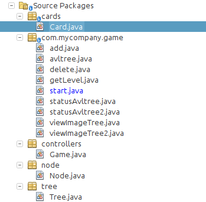
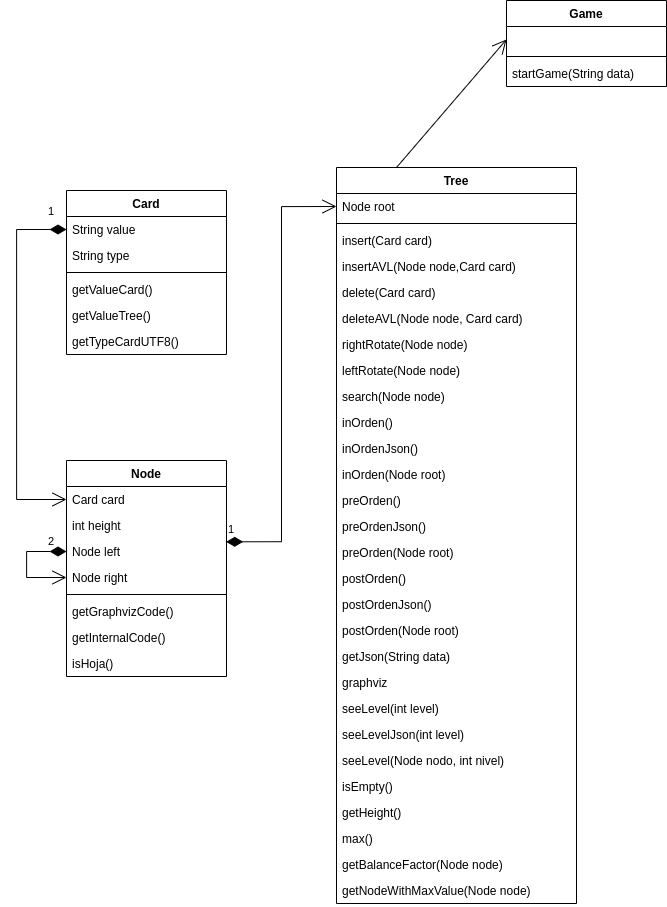

# Proyecto 2 Estructura de Datos
> Estudiante: Ludvin Nicolás Basilio Baquiax Vásquez

> Carne: 201831699

> Junio 2020

## Pyramid

Api la cual es una variante del juego Pyramid, el cual consiste en poder agrupar 2 cartas de una baraja de poker cuya suma de sus pesos sea de 13.

[Requerimientos](#requeqrimientos)

- [Dependencias](#dependencias)

[Clases](#clases)

- [Diagrama de Clases](#diagrama)

## Requerimientos 

- Java EE 7 Web
- Apache Tomcat

### Dependencias 

- Gson 2.8.6
- Graphviz 0.18.1

## Clases

### Diagrama de Clases 

